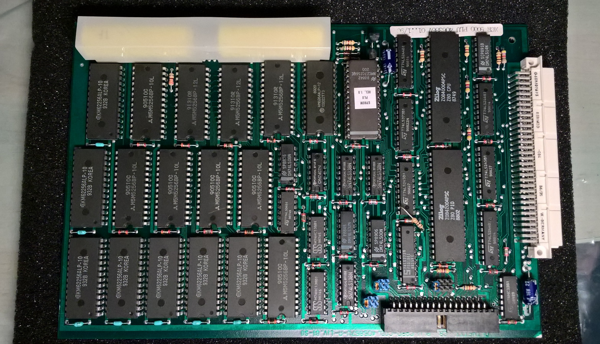
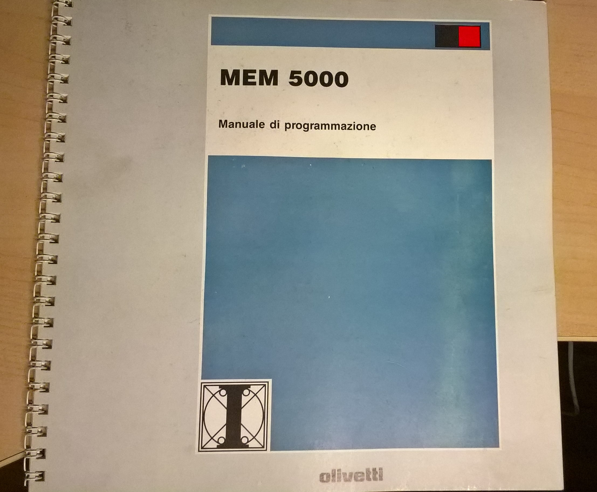
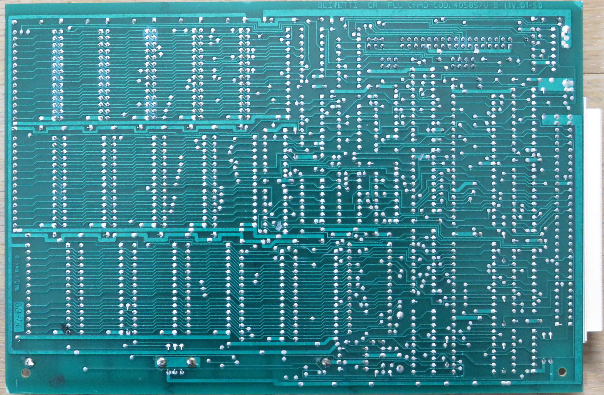
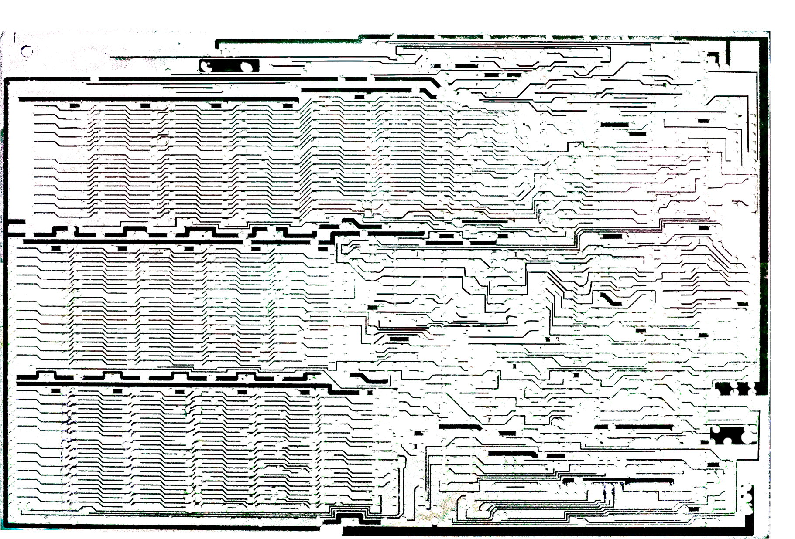
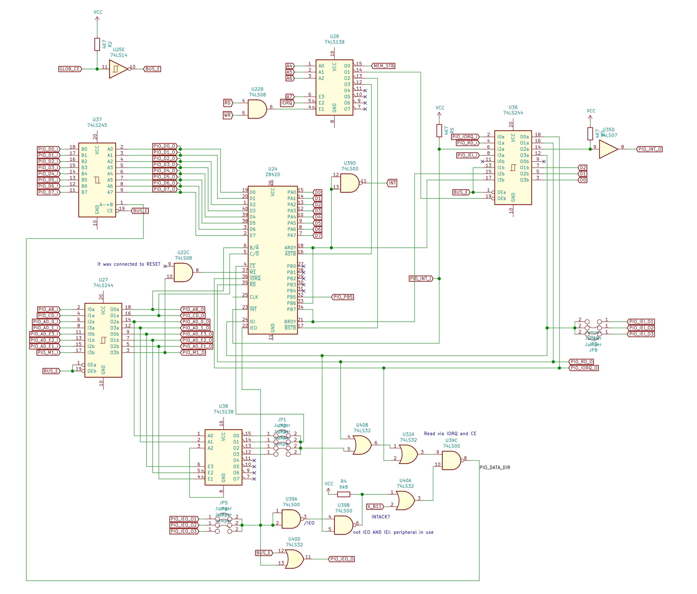
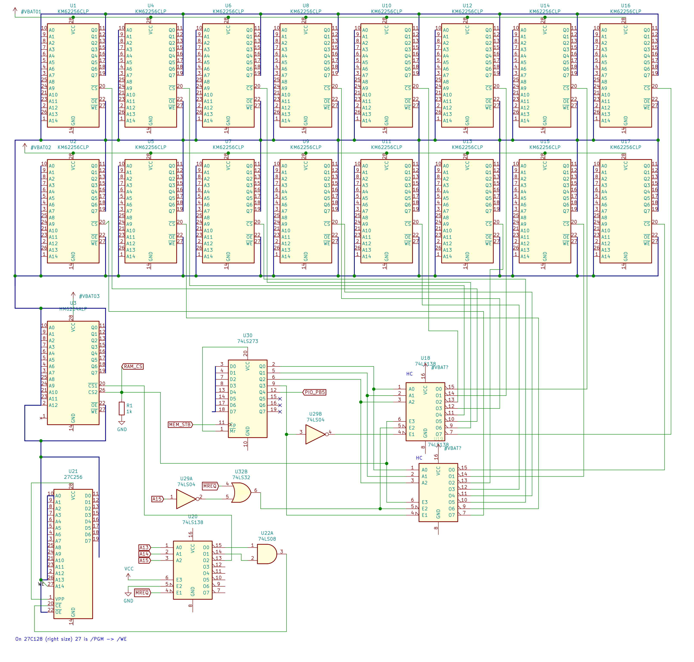
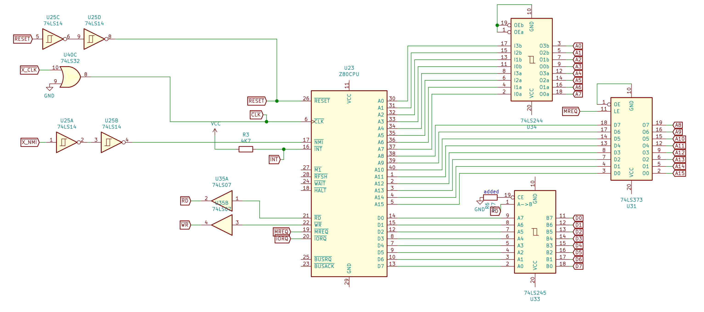

# Olivetti MEM 5000 - A fully fledged Z80 board

When I got the first glimpse of this board, I noticed some interesting features: a `Z80`-based board, some sort of `VME-bus`, a 34-pin floppy-like connector, a `Z80 PIO`, no custom chips, and a lot of static RAM. And _a lot_ really means a huge quantity for a typical compact 8-bit CPU board: sixteen chips of `32Kbx8` static RAM, for a grand total of 512KB. Comparable to a PC IBM!

 
I bought it just for that RAM, since I was unable to find any additional information about it. And, well, also because it was branded Olivetti.
  
## Totally undocumented
 
The board is labeled 01/90, and the chips are mostly dated 1988/89.

The board came with his original shipping box as an optional power-up, and with a short user/operational manual. Thanks to these few pages, I discovered that the board is an *PLU* optional module (Price Look Up) for an elusive `Olivetti XCR 5000` system, model `MEM 5512`.

The Olivetti business was in cash registers at that time, so it is possible that the `XCR 5000` was something related to supermarkets.
 
But... it seems that even Google doesn't know anything about such system. Not a photo, not a spec, not a reference. 
 
The RAM is then used as a persistent data-base. A couple of rechargeable battery makes the memory non-volatile in case of power downs. The two yellow `AA`-sized cells soldered on the board are not labeled in any way. The voltage now is dropped to a hundred of mV, but we can imagine some sort of `NiCd` cell of about 400/500mAh. 

There are two different brands of RAM chips on this board, but surprisingly, at least the `KM62256ALP` was quite a good choice for low-power applications: few µA of standby current with a `2V` minimum retention voltage.
 
It seems that Olivetti designed quite a robust non-volatile solid-state mass memory storage for his `XCR 5000` system. Not sure of the static RAM price at that time, but it should have costed a lot.
 
The bus connection is a 96 pin `DIN 41612` (3x32) female connector, with only the A and C rows. Looking at the power pins (4 outer pins of each end), it doesn't seem to match any know standard bus (`VMEbus`, `STEbus`, etc…).
 
There is another connector, very similar to a floppy 34 pin male, but – again - the power pins don’t seem to match a disk connection.
 
Since no schematics and neither service manuals seem to be available, the only way to shade a light about this mini-computer is to try to attempt a reverse engineering of the board.
 
## Reverse engineering: how to spend time during the 2020's lock-down
 
The boards have only two layers, and the track density is not too high. 

So, I've snapped a couple of photos of the two sides with the best possible light, and tried to clean it up with `GIMP`. The idea was to extract the vectorized tracks and to import it on a cad to rearrange the schematic.
 
But at the end, any attempt to correct the colors and enhance the contrast to obtain non-interrupted tracks resulted in a waste of time.

Since more than half of the board (the RAM part) is made of simple pin-by-pin bus connections of the RAM chips, I changed approach and started to create the schematic on `KiCad` from scratch.
 
With a new layer in `GIMP` and a continuity tester I kept track of the hidden traces under the components. Every time a new integrated circuit was added to the schematic, I annotated his name back on another layer (similar to the component name layer). The only trick required is to correctly align the front and back layers, distorting it enough to cancel lens distortion and any perspective error.
 
Trying to anticipate the hidden connections by knowing the bus line functions (e.g., `/RD` and `/WD` lines, addresses and data bus, chip enable lines, etc...) is speeding up the work a lot.
 
The reconstruction of the circuit started then from the memory banks, since this part was the most intriguing. Them after few hours I was able to propagate the schematic to the addressing logic, then eventually including the `CPU` and the `PIO`. The connectors were added at last.

With a lot of surprises. 

[Schematics](./doc/schematics.pdf)
 
## PIO as slave
 
First non-obvious finding: the `Z80 PIO` is not directly connected to the `Z80 CPU` bus. And, secondly, the `CPU` bus is not exposed on the connectors at all.
 
The board design makes clear that the `PIO` is controlled by the main `XRE` host (let's assume it to be based on Z80 architecture). So, the rest of the board (CPU, BIOS ROM and RAM banks) is hidden behind the parallel PIO, that acts as a peripheral interface.
 

The main 96-pin board connector can address the PIO, using one of four different addresses: it is very likely that host bus address lines are available there, but we can't know how these are named and used to decode the chip enable line. There are many unused pins, enough to map the 16-bit address bus. 
 
The side 34-pin connector appears to be mainly a mirror of the board connector, without the address bus. But in addition, it can take priority over the main connector, electrically disconnecting the board from the main connector. 
 
The `PIO` integration with the local `Z80` bus seems to be designed to be fully 8-bit bidirectional (`PIO mode 2` of port A), as half duplex. So, the PIO can "read" the local data bus of the CPU when the port A strobe line is triggered by a `I/O OUT` instruction, and it puts the data back on the bus when the B port strobe is triggered by a `I/O IN` instruction. 

The strobes are controller by the `3-to-8` multiplexer `U28`, used as I/O port address decoder. The address in decoded partially, since only the high nibble of port address is used. In addition, both I/O read and write operations triggers the chip enable lines: so, performing an OUT operation with the address of an input port will cause bus data contention. 

The first bit (`0x8x` port) will latch the RAM memory bank byte. The second bit (`0x9x` address) enables an input port implemented with the `U36B`, that samples some `PIO` status lines. The third and fourth lines (`0xAx` and `0xBx` ports) are piloting the PIO data in/out sampling.
 
This design of the PIO strobes is confirmed disassembling the Rom equipped on the board: `OUT 0xA0` and `IN 0xB0` operations are found.
 
The `PIO A/B` ready lines (data available for read and data acquired by host system, respectively) can be polled via the `0x9x I/O port`. In addition, the local `Z80` interrupt line is triggered when new data is available for read. 
 
The host `XRE` can instead read/write the `A` port content byte interfacing the PIO registries through the Z80 bus side. 
 
The maximum data throughput depends on how fast the board CPU can poll for new bytes and read it.
 
There is some additional circuitry attached to the `/M1` line of the `PIO`. This input is required for both interrupt management (decoding of `RETI` instruction fetch) and for reset (the `PIO` doesn’t have a `/RESET` input, but it decodes the `/M1` assertion without `/RD` nor `/WR`, generated by the Z80 CPU during the reset cycle).

The logic around `U22C` seems to simulate the same combination (`/M1` low) when the board `/RESET` line is asserted. However, it seems that the original design contained some flaws, since the board is patched: a wire is truncated and then the `/RESET` input is not used (left floating?). Probably the Olivetti engineers realized that the XCR host starting procedures are enough to reset the PIO (or not compatible at all).
 
Both `PIO` ready lines are connected to 2 bits of `B port`. The `B port` can only run with `mode 3` when the `A port` is bidirectional, so the PIO can be programmed in order to trigger interrupts when one of the ready lines is set (data ready or buffer empty).
 
There is an additional memory latch bit that is sent back via `B port`. This can be used for data direction arbitration, to avoid concurrent data send by the host (`XCR`) and by the card itself (`PLU`).
 
## Memory banks
 
The implemented memory paging allows bank switching in the upper half of addressing space (`0x8000-0xFFFF`). The lower addressing page has fixed allocation of an 8kB/16kB ROM (based at `0x0000`, for proper boot) and 8kB of additional static RAM, accessible from `0x4000` to `0x5ffff`.

The arrangement of the `A13` line of the equipped `27C256 EPROM` is quite strange: it is actually connected to the `/WR` line, matching the same pin-out of the static RAM chips. Since `/WR` is always high during read cycles, a `16kB ROM` would always be accessed in the higher addresses. The rom dump confirms that the program is only contained in the upper `8kB` of the ROM addressing space.
 
Fitting a proper `27C128 EPROM` will expect the low-voltage `/PGM` line at that pin. So perhaps the board was originally designed for `8kB` ROMs, and the Olivetti designers connected the `/WR` line for symmetry of RAM chips: since the `Vpp` line is hard linked to `5V`, on-board programming is anyway impossible.
 
Another design peculiarity is the way the dedicated `U18/U19` chips drives the `/CS` RAM lines down when not in use. These drivers are of `CMOS` technology, since they must be powered by battery power when the board is disconnected or the main system is not powered. These line drivers are required to ensure the `62256 CMOS` static RAMs remains in low power mode to avoid to drain the batteries. When the board is installed and the main system is powered up, the line `RAM_CS` should logically receive `Vcc`, so all RAM chips are enabled for use.

(Strange, I would expect `RAM_CS` to be connected to external `+Vcc`, so it would not require a specific bus connection. Perhaps this pin signals external power line presence.)
 
It is interesting to see that the `8kB` RAM chip too is backed-up as well when powered off. This can be for architecture symmetry reasons, or because the RAM there is designed to contain non-volatile data as well (e.g., for shared indexes), in addition to stack and scratch pad memory for the main on-board CPU.
 
The `U30` is an 8-bit latch that acts as a register for the page selector. The upper 4 bits are used to select one of the sixteen `32kB` banks in the higher page (`A15` high). The higher bit 3 alternatively enables one of the two `3-to-8` decoders.
 
The latch register reset line is hard-coded to 1, so resetting the board via `/RESET` line would never reset this register. 
 
## The CPU drivers
 
It is possible that the fan-out of `Z80 CMOS` CPU address bus lines is not enough to drive the whole memory bank and the address logic.

So, latches are included in the board (`U31` and `U34`). Interestingly, the upper half the address lines (`A8-A15`) are latched on `/MREQ`, instead of being amplified transparently like the lower line. Most probably this is to avoid too many variations during CPU operations, and save some power or glitches of the memory address selector logic.
 
An 8-bit two-way `74LS245` transreceiver (`U33`) is used for data line. The direction is simply determined by `/RD` line: when not asserted, the Z80 bus is never engaged. 
 
## The secondary connector
 
The secondary `34-pin IDC connector` remains a design incognito. The purpose seems to be a direct drive for the board `PIO` bus, but with the possibility of by-passing the main board connector. The line `GLOB_CE` on the secondary connector can disable all output drives to the main bus.
 
Through that connector (or even the main one when not disabled), the board PIO enable line can be decoded from 2 lines (called here `PIO_AD_0/1`). Jumpers can select one of 4 ID to enable the PIO chip enable line. In addition, `PIO_AD_E1/3` lines must match the `001` binary code to enable the board. Is this being a hard-coded hardware ID for PLU boards in the XCR system?

Probably this is a debugging port, specifically designed for the XCR system, compatible to different boards.
 
The PIO-generated `/INT` output is exposed in both connectors. Since it is open-drain, it requires the `R5` pull-up. The pin `PIO_INT_O` in the primary connector is applied with a `74LS07` to meet the open-collector specification. This allows multiple boards to drive the `/INT` low at the same time.

In addition, both connectors expose the daisy-chain interrupt pins `IEI` and `IEO`, common to `Z80 SIO` and `CTC`. With these lines it is possible to implement a priority-based interrupt logic.

The primary connector only has one `IEI` and `IEO` pins. So probably the priority is determined by socket slot position (it is easy to imagine a back-plane that supports multiple extension boards).

The secondary connector instead has three independent `IEI` and `IEO` pins. The jumpers on the board allow configuration of which line to use. So, it seems that through this connector it is possible to configure the priority manually for each board.

Given that, it is possible that the secondary connector is to allow different `XCR` architectures (that doesn’t expose the full bus address, but only the pins required by the classic `Z80 PIO/SIO/CTC` peripherals). Another possibility is that the connector is for debug only.

The interrupt pin design are enforcing the supposition that the XCR is Z80-based.

## All the rest

The main clock should be fed via the primary connector. Being the `Zilog Z80` chips of `NMOS` series, the max clock is `4MHz`, with that one can obtain great performances for a single-board home computer.

Transforming the board in an single-board computer is definitely achievable. However, the `Z80` bus cannot be extracted via the connectors without rerouting dozen of traces.

So the best option is to reuse the board as is, accessing to bidirectional data via the `PIO`. For example, a simple serial-line connector can be designed to access the computer as a remote terminal. Or a simple ad-hoc graphic display adapter could be implemented as well (with a limited throughput due to I/O bus slower timings).

Going deeper, the serial line can be multiplexed in order to emulate different hardware, like disk system, and obtaining a great headless educational CP/M system, without rerouting too much lines of the board. The only requirement would be to allow RAM to be paged in the low addressing space after the boot.

Otherwise...

[Some ideas to convert it as CP/M computer](./doc/cpm.md)